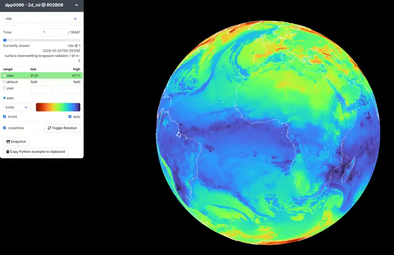

# gridlook

GridLook is a WebGL-based viewer for Earth system model (ESM) output. It supports cloud-hosted Zarr datasets.



## Try It Live

Try out the example dataset:

https://gridlook.pages.dev

You can view any CORS-enabled, public Zarr dataset with GridLook:

```
https://gridlook.pages.dev/#<ZARR_URI>
```

## Project Setup

This project uses [Node.js](https://nodejs.org/en) and [vue.js](https://vuejs.org/)

```sh
npm install
```

### Compile and Hot-Reload for Development

```sh
npm run dev
```

### Type-Check, Compile and Minify for Production

```sh
npm run build
```

### Lint with [ESLint](https://eslint.org/)

```sh
npm run lint
```

## Customize configuration

See [Vite Configuration Reference](https://vitejs.dev/config/).

### Usage

The project is served at http://localhost:3000/ when you run `npm run dev`.

### CORS & Hosting Notes

To load datasets from services like DKRZ Swift, ensure [CORS](https://developer.mozilla.org/de/docs/Web/HTTP/Guides/CORS) is enabled on the server.

Example for the nextGEMS container on Swift:

```
swift post nextGEMS -m "X-Container-Meta-Access-Control-Allow-Origin:*"
```

This allows GridLook to fetch data directly from the container in your browser.
